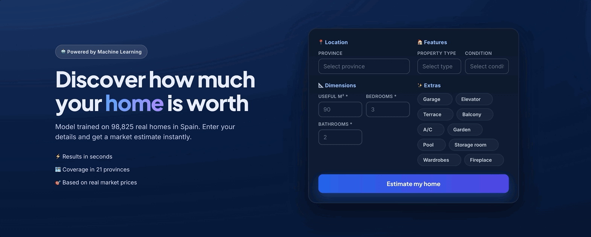
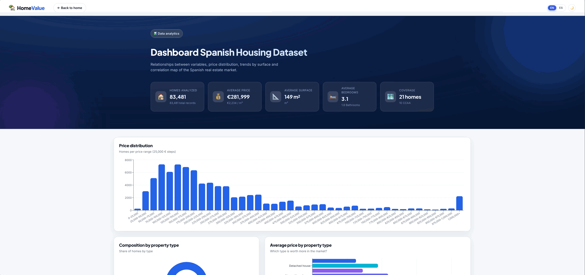

<div align="center">

# 🏡 HomeValue — Housing Price Estimation in Spain


Web platform to estimate housing prices in Spain with a **Machine Learning** model (Random Forest, scikit-learn), combined with an interactive map to explore listings by **autonomous community** and **province**.

 
 
 

[](LICENSE)
[](CONTRIBUTING.md)

</div>

---

## Demo & interface overview

### Main flows

| Flow | Preview | Description |
|------|---------|-------------|
| **Index usage** | <!-- GIF 1: index usage --><br> | Navigate the landing, scroll through the hero, form and interactive map. |
| **Price estimation** | <!-- GIF 4: price estimation --><br> | Fill in Province / Type / Condition / m² / Rooms / Baths + extras and get the instant ML estimate. |
| **Dashboard usage** | <!-- GIF 2: dashboard usage --><br> | Explore the analytics dashboard: price distribution, composition, trends and province breakdowns. |
| **Light / Dark toggle** | <!-- GIF 3: theme toggle --><br> | Switch between light and dark mode — glassmorphic cards adapt instantly. |


## Why this project?

**HomeValue is strictly educational.** It is not a certified appraisal tool and estimates are **for informational purposes only**.

<p align="center">
  
</p>

* **Learn by building:** end-to-end exercise — from data cleaning and a scikit-learn Random Forest to a FastAPI backend and a React + Vite + Leaflet frontend.
* **Understand the market:** visualize how price correlates with surface, location, type and condition using ~98k real Spanish listings.
* **Practice good product design:** glassmorphic UI, `data-theme="dark"` theming, i18n (`en`/`es`), responsive layout and paginated APIs.
* **Open & reproducible:** dataset and model are external (see [Notes](#notes)), code is MIT — fork it, break it, improve it.

---

## Features

- **Home valuation:** enter your property's features and the model instantly estimates its market value.
- **Interactive map of Spain:** click an autonomous community to zoom in and discover its provinces.
- **Counts per province:** each province shows the number of listings registered in the database.
- **Property listings:** select a province to load paginated property cards.
- **Full REST API** with prediction, listing and aggregation endpoints.

## User Flow

1. Top section → valuation form (`POST /api/predict`).
2. Map → click an autonomous community → zoom → provinces with their counts.
3. Click a province → right panel with paginated property cards.

---

## Requirements

- Python **3.10+**
- Node.js **18+** and npm (only to build the frontend)
- The trained model `models/random_forest_model.joblib` (**not committed by default**, see [Notes](#notes))
- The database `data/properties.db` (generated from the dataset `data/spanish_housing_clean.csv`, see [Notes](#notes))

## Getting Started

### Option A) One command (recommended)

`./run.sh` at the repository root does everything for you — install, build and run:

```bash
chmod +x run.sh   # first time only
./run.sh
# or with a custom interpreter: PYTHON_BIN=python3.11 ./run.sh
```

What it does (`run.sh:1`):
1. Checks Python deps (`fastapi`, `uvicorn`, `pandas`, `scikit-learn`, `joblib`) and runs `pip install -r requirements.txt` if any are missing (`run.sh:11`).
2. Checks `client/node_modules` and runs `npm install` inside `client/` if missing (`run.sh:17`).
3. Builds the frontend with `npm run build` into `app/static` — the bundle served by FastAPI (`run.sh:23`).
4. Starts the full stack (API + built frontend) with `uvicorn app.main:app --host 0.0.0.0 --port 8000` (`run.sh:26`).

Then open **http://localhost:8000**.

### Option B) Manual

**1. Python dependencies**

```bash
python3 -m pip install -r requirements.txt
```

**2. Frontend**

```bash
cd client
npm install
npm run build      # outputs the build to app/static (served by FastAPI)
```

**3. Run**

```bash
uvicorn app.main:app --host 0.0.0.0 --port 8000
```

Open **http://localhost:8000** 🎉

## Development (hot-reload)

Run the backend and the Vite frontend separately:

```bash
# Terminal 1 — API
uvicorn app.main:app --reload

# Terminal 2 — Vite (hot reload at http://localhost:5173)
cd client && npm run dev
```

Vite is already configured to **proxy `/api/*`** to `127.0.0.1:8000`, so `curl`/browser always talk to the same API.

## API

| Method | Route | Description |
|--------|-------|-------------|
| `POST` | `/api/predict` | Price estimation (ML model) |
| `GET` | `/api/properties/` | Paginated listing (`?province=&ccaa=&min_price=&max_price=`) |
| `GET` | `/api/properties/{id}` | Property detail |
| `GET` | `/api/properties/count/province` | Counts per province |
| `GET` | `/api/properties/count/ccaa` | Counts per autonomous community |
| `GET` | `/api/health` | Service health check |

### Prediction example

```bash
curl -X POST http://localhost:8000/api/predict \
  -H "Content-Type: application/json" \
  -d '{
    "m2_real": 90,
    "room_num": 3,
    "bath_num": 2,
    "province": "Madrid",
    "house_type": "Piso",
    "condition": "segunda mano/buen estado",
    "garage": 1,
    "lift": 1
  }'
```

```json
{ "prediction": 175712.37 }
```

## 🗂️ Project Structure

```
.
├── app/                    # FastAPI backend
│   ├── api/routes/         # Endpoints (predict, properties)
│   ├── db/                 # SQLite + repository
│   ├── models/             # ML model loading
│   ├── processing/         # Preprocessing, encoding, feature engineering
│   └── static/             # Frontend build (generated)
├── client/                 # Frontend React + Vite + Leaflet
│   ├── public/assets/geo/  # GeoJSON of Spanish provinces
│   └── src/
├── data/                   # Dataset and SQLite (git-ignored)
├── models/                 # Trained model (git-ignored)
└── requirements.txt
```

## Data

- **~98,000** real listings from the Spanish market.
- 21 provinces with data; 10 autonomous communities.
- Official Spanish geography (province polygons) at `client/public/assets/geo/provincias_spain.geojson`.

## 📝 Notes

- The model `random_forest_model.joblib` and the database `properties.db` are in `.gitignore` due to size. To reproduce them:
  1. Place `spanish_housing_clean.csv` in `data/`. You can [download the dataset here](https://huggingface.co/datasets/Davidpm02/spanish_housing_cleaned/resolve/main/spanish_housing_clean.csv?download=true).
  2. [Download the model](https://huggingface.co/Davidpm02/spanish_housing_rf_model/resolve/main/random_forest_model.joblib?download=true) and save it to `models/random_forest_model.joblib`.
  3. Seed the DB with `python3 -m app.db.seed`.
- Estimates are **for informational purposes only** and do not constitute an official appraisal.

## License

MIT — see [LICENSE](LICENSE).
